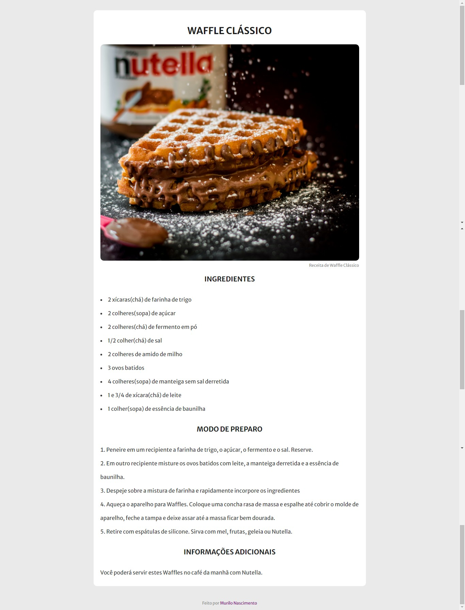

# Projeto Página Receita
Projeto criado através da plataforma Rocketseat na trilha Explorer.
## Deploy da aplicação

https://pagreceit.netlify.app/

## Tecnologias utilizadas

+ HTML5
+ CSS3

## Estrutura do site

+ Título: Título do prato.
+ Ingredientes: Lista de ingredientes para a realização da receita.
+ Modo de Preparo: Passo a passo de como realizar a receita.
+ Exposições: Local onde é possível ver as exposições do museu.
+ Informações Adicionais: Alguma outra informação que possa ser relevante.

## Tela Inicial 

